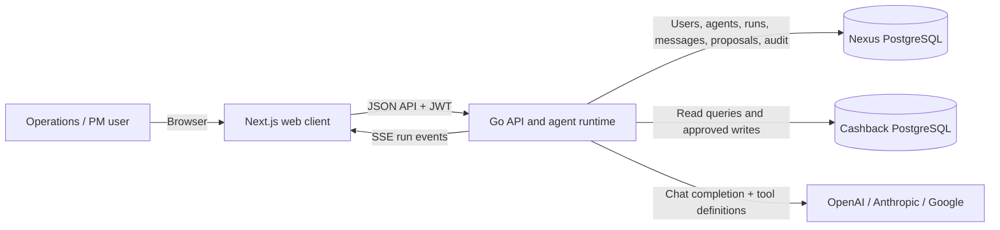
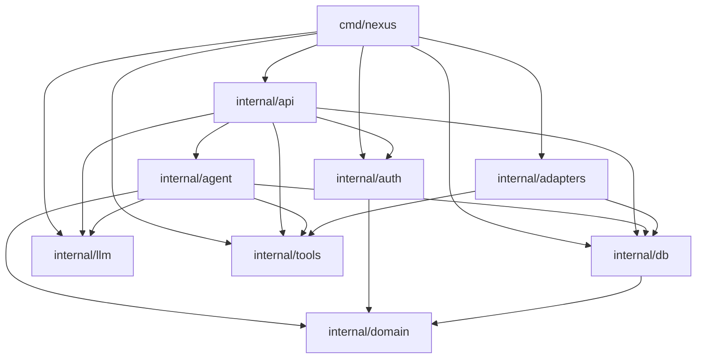
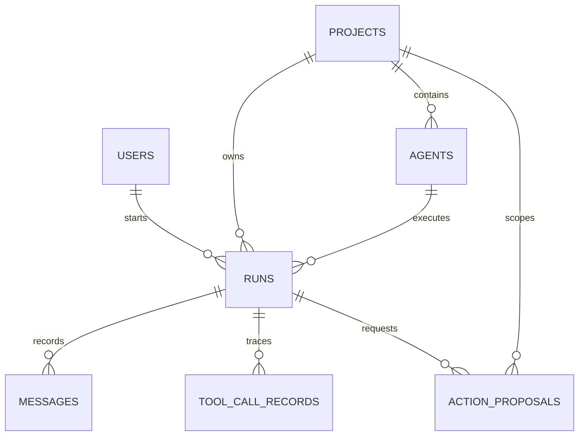
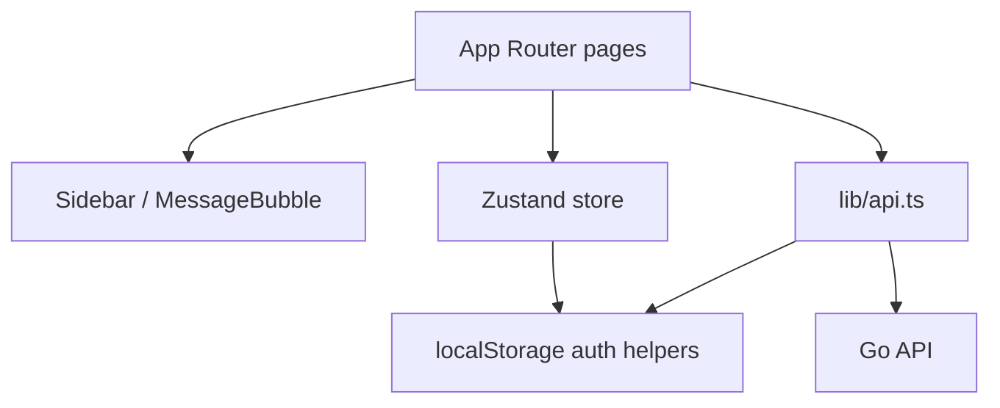
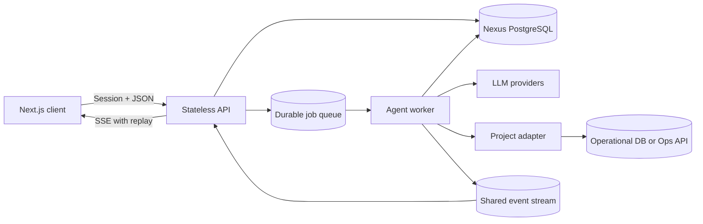

# Nexus Architecture

## 1. Executive summary

Nexus is an internal **agentic operations platform**. Its first and currently only project adapter is **Offline Cashback**, where an LLM-backed agent investigates card-registration failures and can propose corrective database actions.

The repository is a two-process application:

- **Web client:** Next.js 15, React 19, TypeScript, Tailwind CSS
- **API and agent runtime:** Go 1.23, Gin, PostgreSQL, direct HTTP integrations with LLM providers

The backend is best described as a **modular monolith with ports-and-adapters elements**:

- HTTP/API, authentication, agent orchestration, persistence, LLM providers, and project tools are separate packages.
- `llm.Provider` and `tools.Adapter` are extension interfaces.
- Everything is composed in one Go process and shares one relational store.

The central safety mechanism is a **human-in-the-loop write boundary**: read-only tools execute immediately, while write tools create an `action_proposals` record and wait for a person to approve or reject it.

This document describes the code as it exists today. Where comments or configuration describe behavior that is not implemented, that difference is called out explicitly.

---

## 2. System context



The Next.js development server proxies `/api/*` to the Go server. The browser therefore talks to one apparent origin even though the application consists of two local processes.

Key files:

- `web/next.config.ts` — API rewrite
- `server/cmd/nexus/main.go` — backend composition root
- `server/internal/api/server.go` — HTTP routes and handlers
- `server/internal/agent/runner.go` — LLM/tool execution loop

---

## 3. Repository map

```text
Nexus/
├── Makefile                       Local setup, build, lint, and run commands
├── docker-compose.yml             Local PostgreSQL and Redis
├── .env.example                   Runtime configuration contract
├── server/
│   ├── cmd/
│   │   ├── nexus/                 API server executable
│   │   ├── migrate/               Schema migration executable
│   │   └── seed/                  Development user/project/agent seed
│   ├── internal/
│   │   ├── adapters/              Project-specific tools
│   │   ├── agent/                 Agent orchestration loop
│   │   ├── api/                   Gin routes, handlers, and SSE broadcaster
│   │   ├── auth/                  Password hashing, JWTs, middleware
│   │   ├── config/                Environment configuration
│   │   ├── db/                    PostgreSQL access and migration
│   │   ├── domain/                Shared domain records and enums
│   │   ├── llm/                   Provider abstraction and implementations
│   │   └── tools/                 Tool and adapter abstractions
│   └── go.mod
└── web/
    ├── src/app/                    Next.js App Router pages
    ├── src/components/             Sidebar and chat rendering
    ├── src/lib/                    API client, auth, types, Zustand store
    ├── next.config.ts
    └── package.json
```

Generated directories such as `web/.next/` and installed dependencies under `web/node_modules/` are not part of the authored architecture.

---

## 4. Backend architecture

### 4.1 Composition root

`server/cmd/nexus/main.go` wires the process in this order:

1. Load `.env` and environment variables.
2. Load typed configuration.
3. Connect to the Nexus PostgreSQL database.
4. Execute the embedded initial schema.
5. Optionally connect to the Cashback database.
6. Register configured LLM providers.
7. Register project adapters and their tools.
8. Create the JWT authentication service.
9. Construct the Gin API server and agent runner.
10. Start HTTP and handle graceful shutdown.

Dependency construction is explicit rather than container-based. This keeps startup understandable, but concrete types such as `*db.Store` are passed through most layers, which limits isolation in tests.

### 4.2 Module dependency direction



There is no separate application-service layer for most CRUD operations; API handlers call the store directly. The agent workflow is the main exception and lives in `internal/agent`.

### 4.3 Domain model

The core records are defined in `server/internal/domain/types.go`:

- **User** — identity and one of `admin`, `ops`, or `pm`
- **Project** — logical product area and its adapter ID
- **Agent** — system prompt, provider/model defaults, allowed tools, and step limit
- **Run** — one persisted investigation session
- **Message** — user, assistant, or tool turn within a run
- **ToolCallRecord** — timing, input, output, and error for executed read tools
- **ActionProposal** — a requested write action and its approval lifecycle
- **AuditLog** — an approval/rejection audit event

The PostgreSQL schema in `server/internal/db/migrations/001_initial.sql` mirrors these structures.

Important relationships:



Audit logs intentionally use plain IDs rather than foreign keys. Tool call `message_id`, proposal `acted_by`, and audit user/resource IDs also have no database-level referential constraints.

### 4.4 Persistence

`server/internal/db/store.go` is a hand-written SQL data-access layer using `pgxpool`.

Characteristics:

- No ORM or query generator
- Domain structs are populated directly from rows
- JSONB stores allowed tools, tool calls, proposal parameters/results, and audit payloads
- Runs and message history persist LLM context between turns
- Dashboard queries read the external Cashback database directly

Migration is currently one embedded, idempotent SQL file. It is executed both at server startup and by `cmd/migrate`. There is no migration history table or ordered migration runner.

### 4.5 Authentication and authorization

Authentication is email/password plus an HS256 JWT:

1. Login fetches a user by email.
2. bcrypt validates the password.
3. The server issues a JWT containing user ID and role.
4. Protected routes parse the bearer token.

The browser stores the JWT and user object in `localStorage`. For EventSource, the token is placed in the stream URL query string because native EventSource cannot set an Authorization header.

Roles exist in the domain and `RequireRole` middleware exists, but **no route currently applies role authorization**. All authenticated roles can list, approve, and reject proposals.

### 4.6 HTTP API

All application routes except login and health are JWT-protected.

| Area | Routes | Purpose |
|---|---|---|
| Health | `GET /health` | Process liveness only |
| Auth | `POST /api/auth/login`, `GET /api/auth/me` | Session creation and identity |
| Providers | `GET /api/providers` | Configured LLM provider names |
| Projects/agents | `GET /api/projects`, `GET /api/projects/:id/agents`, `GET /api/agents/:id` | Agent discovery |
| Runs | `POST /api/runs`, `GET /api/runs`, `GET /api/runs/:id` | Investigation lifecycle |
| Messages | `GET/POST /api/runs/:id/messages` | Persisted conversation and execution trigger |
| Streaming | `GET /api/runs/:id/stream` | Real-time server-sent events |
| Proposals | `GET /api/proposals`, `POST .../approve`, `POST .../reject` | Human write approval |
| Dashboard | `GET /api/dashboard/cashback` | Live Cashback pipeline metrics |

The response convention is `{ "data": ... }` for success and `{ "error": "..." }` for failure.

### 4.7 Agent execution loop

`server/internal/agent/runner.go` is the architectural center.

```mermaid
sequenceDiagram
    participant Browser
    participant API
    participant Runner
    participant NexusDB
    participant LLM
    participant Tool

    Browser->>API: Create run
    API->>NexusDB: INSERT run (pending)
    Browser->>API: Open SSE stream
    Browser->>API: POST user message
    API-->>Browser: 202 Accepted
    API->>Runner: Execute in goroutine
    Runner->>NexusDB: Run = running; save user message
    Runner-->>Browser: SSE user message
    Runner->>NexusDB: Load prior messages

    loop Up to agent.max_steps
        Runner->>LLM: System prompt + conversation + tool schemas
        LLM-->>Runner: Text and/or tool calls
        Runner->>NexusDB: Save assistant message
        Runner-->>Browser: SSE assistant message

        alt No tool calls
            Runner->>Runner: Finish
        else Read-only tool
            Runner->>Tool: Execute immediately
            Tool-->>Runner: JSON result
            Runner->>NexusDB: Save tool record and tool message
            Runner-->>Browser: SSE tool message
        else Write tool
            Runner->>NexusDB: Create pending proposal
            Runner->>NexusDB: Save pending result as tool message
            Runner-->>Browser: SSE tool message
        end
    end

    Runner->>NexusDB: Run = completed
    Runner-->>Browser: SSE done
```

The LLM conversation is provider-neutral inside the runner. Each provider adapter translates normalized messages and tools to its own API:

- OpenAI Chat Completions
- Anthropic Messages
- Google Gemini `generateContent`

Google thought signatures are stored alongside tool-call JSON so Gemini thinking/tool conversations can be reconstructed on later turns.

### 4.8 Tool and adapter system

`internal/tools` defines two extension points:

- `Tool` — name, description, JSON Schema, read/write classification, execute function
- `Adapter` — adapter ID and a set of tools

The `offline-cashback` adapter currently provides:

- `get_pending_summary`
- `get_stuck_in_progress`
- `get_card_banks`
- `get_cards_by_user`
- `get_recent_response_codes`
- `unlock_in_progress` (write)

The first five issue parameterized SQL reads against the Cashback database. `unlock_in_progress` updates `users_card_bank.add_in_progress`, but the runner never invokes it directly: it first creates a pending proposal.

Although configuration and comments mention an HTTP adapter mode, the current adapter only contains a PostgreSQL pool. In HTTP mode the pool remains nil and all tools report that the Cashback database is not configured. HTTP mode is therefore **designed but not implemented**.

### 4.9 Human approval boundary

Write safety is based on `Tool.ReadOnly`:

- `ReadOnly=true`: execute and record immediately.
- `ReadOnly=false`: save a pending proposal and return a pending-approval result to the LLM.
- Approval endpoint: find the tool by name, mark approved, execute it, mark executed or failed, and write an audit event.
- Rejection endpoint: mark rejected and write an audit event.

This is a useful architectural boundary, but authorization and concurrency controls need strengthening before it is a robust security boundary.

---

## 5. Frontend architecture

The web application uses the Next.js App Router, but all interactive application pages are client components.

### 5.1 Pages

- `/login` — authenticate and store JWT/user
- `/dashboard` — Cashback health plus recent runs
- `/chat` — select project/agent, create a run, stream an investigation
- `/runs` — current user’s run history
- `/runs/[id]` — persisted run transcript and token/step metadata
- `/proposals` — pending write approvals
- `/settings` — profile and server configuration visibility

### 5.2 Client layers



`lib/api.ts` centralizes fetch calls, bearer headers, response unwrapping, 401 handling, and EventSource creation. `lib/types.ts` duplicates the backend’s JSON-facing domain shapes. There is no generated API contract.

The Zustand store holds global user, run, message, and proposal state, although most pages currently use component-local state. Authentication state is hydrated from `localStorage` after mount.

### 5.3 Chat behavior

The chat page:

1. Loads projects, then agents for the selected project.
2. On the first message, creates a run.
3. Opens SSE before posting the message to avoid missing early events.
4. Adds an optimistic user message.
5. Replaces it when the persisted user message arrives over SSE.
6. Appends assistant and tool messages as streamed events arrive.
7. Prevents another send in the same UI while a run is streaming.

The stream is event-only: it does not replay missed events. Persisted messages can be fetched separately from the run detail page.

---

## 6. Runtime and deployment model

### Local development

`make setup`:

1. Copies `.env.example` to `.env` if needed.
2. Tidies Go modules.
3. Installs web dependencies.
4. Starts PostgreSQL and Redis with Docker Compose.
5. Runs migration and seed commands.

The Go API and Next.js dev server are then started in separate terminals.

### Current infrastructure use

- PostgreSQL is required for platform state.
- A second PostgreSQL connection is optional for Cashback tools and dashboard data.
- Redis is started and has configuration fields, but **no application code uses it**.
- There are no authored production Dockerfiles, Kubernetes manifests, or CI workflows in the repository.
- The health endpoint checks only that the HTTP process responds; it does not verify database or provider readiness.

---

## 7. Architectural strengths

1. **Clear extensibility seams.** LLM providers and project adapters have small interfaces.
2. **Provider-neutral orchestration.** The agent runner is not tied to one model vendor.
3. **Persisted conversations.** Runs, messages, token counts, and tool traces survive process restarts.
4. **Explicit write boundary.** Read actions and mutating actions have different execution paths.
5. **Parameterized operational queries.** Cashback tool arguments are bound rather than interpolated as raw values.
6. **Small, understandable composition root.** Runtime dependencies are visible in one place.
7. **Graceful HTTP shutdown.** The API stops accepting work and uses a shutdown timeout.
8. **Production web build succeeds.** The current Next.js client compiles and type-checks successfully.

---

## 8. Important gaps and risks

### Critical: resource authorization is missing

Handlers fetch runs and messages by ID without checking that the authenticated user owns the run. Any authenticated user who obtains a run ID can read it or trigger another agent turn. Pending proposals are globally visible.

Recommended change: scope every run/message/proposal query by authenticated user or explicit project membership, with admin-only exceptions.

### Critical: proposal routes do not enforce roles

`RequireRole` exists but is unused. `ops`, `pm`, and `admin` users currently have identical API permissions, including approval and rejection.

Recommended change: define a policy and apply role middleware, typically limiting approval to PM/admin and execution-sensitive reads to appropriate project members.

### High: proposal approval is not atomic

Approval performs a read, checks `pending`, then separately updates and executes. Two concurrent approvals can both observe `pending` and both execute the write tool.

Recommended change: atomically claim a proposal with `UPDATE ... WHERE status='pending' RETURNING ...`, then execute under an idempotency strategy.

### High: in-process execution is not durable

Runs execute in detached goroutines. A process restart loses active work, and multiple API replicas cannot share SSE sinks or coordinate a run.

Recommended change: move run execution to a durable queue/worker model. Redis is already provisioned but unused; PostgreSQL-backed jobs are another option.

### High: run ownership and concurrent execution are not guarded

The API allows multiple message submissions against the same run. Concurrent runners can load overlapping history and interleave messages, status changes, and token counters.

Recommended change: enforce one active execution per run using a database state transition or distributed lock.

### High: default/development credentials are unsafe

The server has a fallback JWT secret, and the seed command creates a fixed admin password. These are acceptable only for isolated local development.

Recommended change: fail startup in production when the JWT secret is missing/weak, and move initial admin creation to a one-time secret-driven bootstrap flow.

### Medium: SSE is ephemeral and leaks registry entries

The sink registry is process-local, has no replay, and never removes completed run sinks. Slow consumer events are silently dropped.

Recommended change: delete sinks after terminal events, add heartbeat/reconnect semantics, and derive replay from persisted messages or a shared event broker.

### Medium: HTTP adapter mode is not implemented

Environment fields and UI imply a DB/HTTP choice, but only DB tools exist.

Recommended change: either implement an HTTP adapter behind a common data-access interface or remove the mode until supported.

### Medium: adapter selection is hard-coded

The runner always asks for `offline-cashback` tools rather than loading the run’s project and using its `adapter_id`. This prevents the current plugin design from actually supporting multiple projects.

Recommended change: resolve the project for each run and select tools from `Project.AdapterID`.

### Medium: migration strategy will not scale

One embedded idempotent schema has no versions, checksums, rollback information, or migration locking.

Recommended change: adopt ordered migrations and record applied versions.

### Medium: external HTTP clients have no explicit timeout

Provider clients use default `http.Client` instances. Request context cancellation helps, but the detached runner uses `context.Background`, so calls can remain active indefinitely.

Recommended change: give each provider a configured timeout and give every run/step a deadline.

### Medium: token in query strings

SSE authentication sends JWTs in the URL, where infrastructure logs and browser history can expose them.

Recommended change: prefer same-site secure session cookies, a short-lived single-use stream token, or a fetch-based streaming client.

### Medium: errors expose internals

Several API handlers return raw database/tool errors to clients, and provider errors can include upstream bodies.

Recommended change: return stable public error codes/messages and keep detailed context in structured logs.

### Quality: no authored automated tests or CI

The Go packages compile under `go test ./...`, but there are no project test files. The web production build succeeds, but there are no authored frontend tests or CI workflow.

Recommended change: begin with runner state-machine tests, authorization integration tests, proposal concurrency tests, adapter SQL tests, and one chat happy-path browser test.

---

## 9. Recommended target architecture

The current modular monolith is appropriate for the repository’s size. It does not need to become microservices. The next step should be to make its boundaries real and its execution durable.



Suggested internal boundaries:

- **Transport:** Gin handlers, request validation, SSE
- **Application:** run service, proposal service, authorization policies
- **Domain:** run/proposal states and invariants
- **Ports:** run repository, job queue, event publisher, LLM provider, project adapter
- **Infrastructure:** PostgreSQL repositories, Redis/PostgreSQL jobs, provider HTTP clients, Cashback DB/API clients

Prioritized evolution:

1. Enforce ownership and role authorization.
2. Make proposal claiming atomic and write tools idempotent.
3. Prevent concurrent execution of one run.
4. Add deadlines, cancellation, and explicit failure states.
5. Resolve adapters from projects instead of a hard-coded ID.
6. Add tests around the runner and approval boundary.
7. Move execution to a durable worker only when multiple replicas or restart recovery are needed.
8. Implement HTTP adapter mode or remove its configuration.
9. Add production packaging, readiness checks, CI, and structured observability.

---

## 10. How to add functionality

### Add an LLM provider

1. Implement `llm.Provider`.
2. Translate normalized messages/tool definitions into the provider format.
3. Normalize text, tool calls, token usage, model, and provider in the response.
4. Register it in `cmd/nexus/main.go` when configured.
5. Add provider configuration and tests for multi-turn tool use.

### Add a project adapter

1. Implement `tools.Adapter`.
2. Give it a stable adapter ID.
3. Define tools with JSON Schema and accurate `ReadOnly` flags.
4. Register it in `internal/adapters/registry.go`.
5. Seed a project whose `adapter_id` matches.
6. Update the runner to resolve the project adapter dynamically before relying on multi-project behavior.

### Add a write tool

1. Implement the tool as idempotently as possible.
2. Set `ReadOnly: false`.
3. Validate all arguments in the tool, not only in JSON Schema.
4. Ensure approval is role-protected and atomically claimed.
5. Include enough proposal description and parameters for informed human review.
6. Audit both successful and failed execution.

---

## 11. Verification snapshot

At the time of this review:

- `go test ./...` completes successfully; there are no authored Go test files.
- `npm run build` completes successfully with Next.js type checking and static generation.
- No authored GitHub Actions workflow or production container/deployment definition was found.
- Redis is configured and started locally but is not referenced by runtime code.

