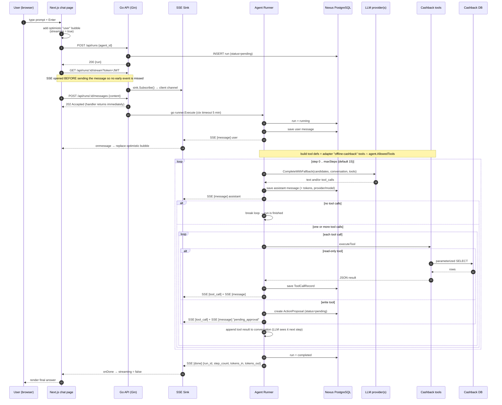
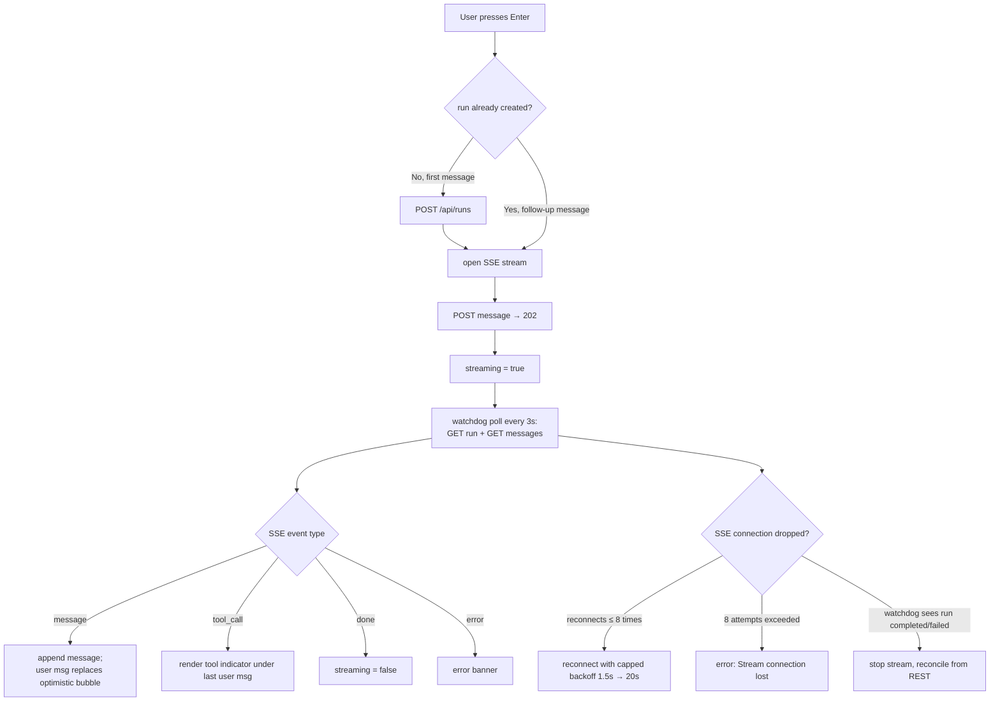
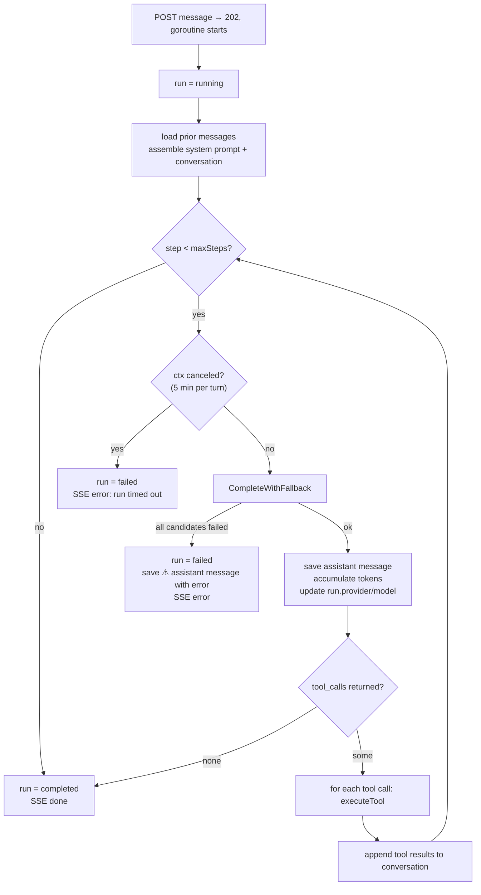
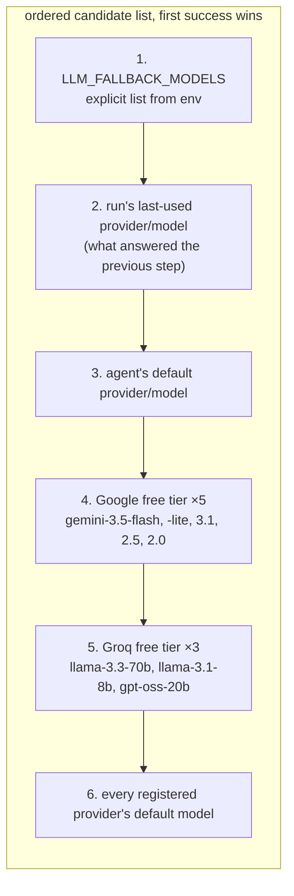
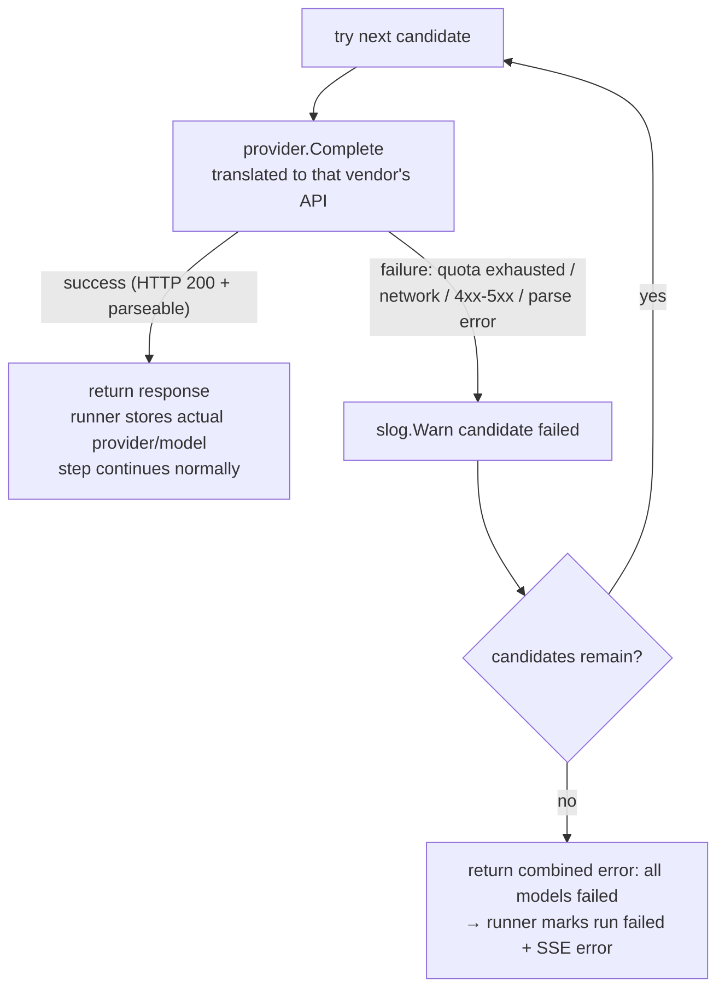
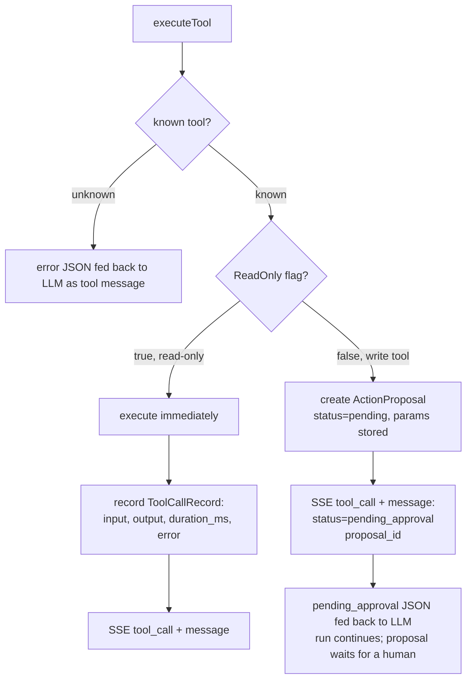
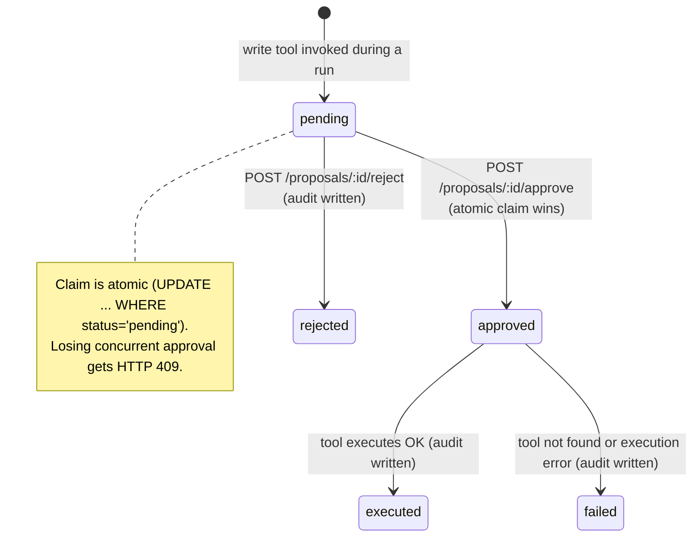
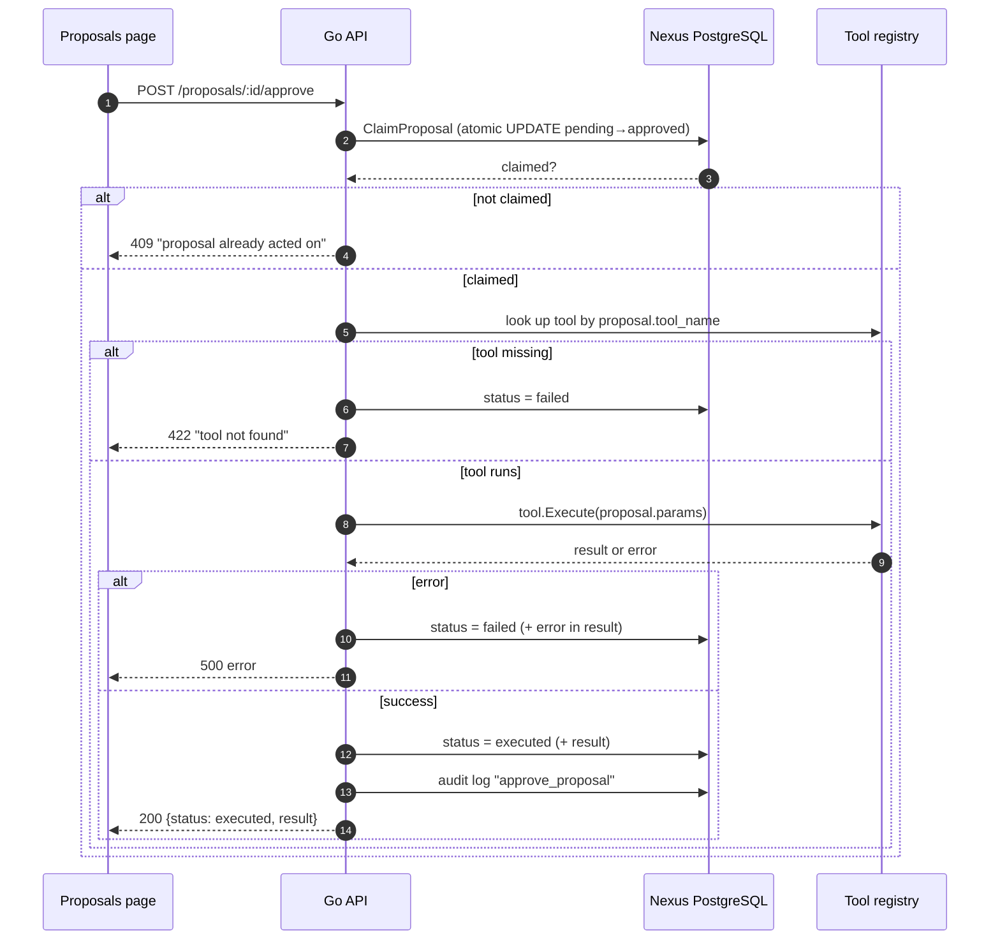
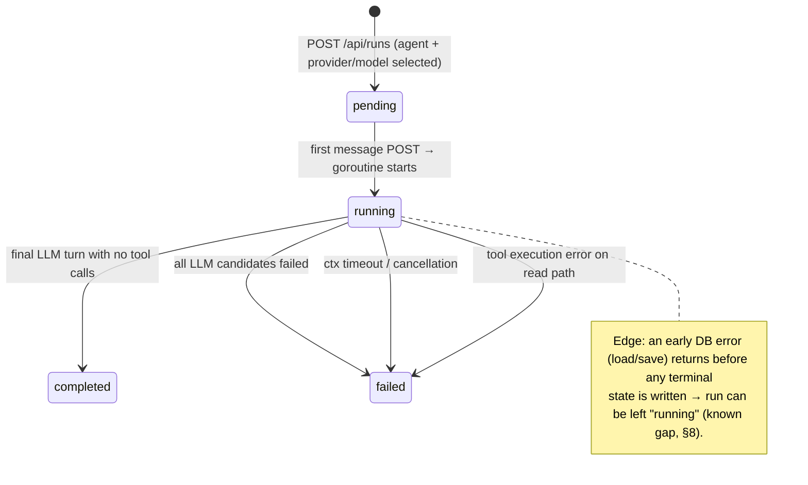

# Nexus — Request Flow & Edge Cases

Visual walkthrough of one user prompt, end to end: from the moment the user
presses Enter in the chat UI until the final AI answer (and every failure mode
in between).

**What is "an agent" here?** A Nexus *agent* is a persona (system prompt +
allowed tools + model defaults) fixed for the whole run. When something fails,
Nexus does **not** switch agents — it switches **LLM model/provider** through a
dedicated fallback chain (see [§4](#4-llm-fallback-chain--switching-models)).
The run always keeps the same agent.

Components (see `ARCHITECTURE.md` for the full picture):

| Abbrev | Component | Code |
|---|---|---|
| `W` | Next.js chat page | `web/src/app/(app)/chat/page.tsx` |
| `A` | Go API (Gin) | `server/internal/api/server.go` |
| `S` | SSE sink (per-run fan-out) | `server/internal/api/sse.go` |
| `R` | Agent runner | `server/internal/agent/runner.go` |
| `D` | Nexus PostgreSQL | `server/internal/db/store.go` |
| `L` | LLM router + providers | `server/internal/llm/*.go` |
| `T` | Cashback tools | `server/internal/adapters/offline_cashback/adapter.go` |
| `CashDB` | Cashback PostgreSQL | optional, read-only |

---

## 1. End-to-end flow (happy path)

Key files: `server.go:262` (sendMessage), `runner.go:116` (Execute),
`sse.go:66` (getOrCreateSink).

---

## 2. Frontend orchestration

Frontend guarantees (from `chat/page.tsx` and `lib/api.ts`):

1. **No missed events:** SSE opens before the message POST.
2. **No double-send:** `sendingRef` guards double Enter in the same tick; the
   send button is disabled while `loading || streaming`.
3. **Optimistic UI:** temporary bubble is replaced once the persisted user
   message arrives over SSE (matched by content + `optimistic-` id prefix).
4. **Drop tolerance:** SSE reconnect with capped exponential backoff; a 3 s
   watchdog polls run status + messages and reconciles the transcript even if
   SSE is gone.
5. **Auth expiry:** any `401` clears `localStorage` and redirects to `/login`.

---

## 3. Agent loop decision tree (backend)

`runner.go:196` — the loop; `runner.go:207` — step counter; `runner.go:214`
— LLM failure path; `runner.go:197` — timeout path; `runner.go:263` — normal
completion.

---

## 4. LLM fallback chain (switching models when one fails)

This is the answer to *"one agent fails, how does it switch?"* — it doesn't
switch agents, it walks an ordered list of `(provider, model)` candidates.

### 4.1 Candidate order

Built fresh on **every step** by `fallbackCandidates` (`runner.go:74`),
deduplicated by `provider/model`:

Candidates whose provider is **not registered** (no API key) or whose model is
empty are skipped. Position 2 is why a run that failed over to Groq keeps using
Groq on later steps instead of bouncing back to the broken primary.

### 4.2 Failure walk

`router.go:66` (`CompleteWithFallback`) never returns a partial result — it is
all-or-nothing per step. Per-step semantics: a *model* failure is handled by
this chain; a *tool* failure is **not** (see §5).

### 4.3 Why switching vendors works

The conversation is provider-neutral (`llm.Message` / `llm.ToolDef`). Each
adapter (`openai.go`, `anthropic.go`, `google.go`) translates it:

| Concern | OpenAI-compatible | Anthropic | Google Gemini |
|---|---|---|---|
| System prompt | `system` message | `system` field | `systemInstruction` |
| Tool schema | `tools[].function` | `tools[].input_schema` | `tools[].functionDeclarations` |
| Tool results | `tool` role message | `tool_result` content block | `functionResponse` part |
| Assistant w/ calls | `tool_calls` array | `tool_use` blocks | `functionCall` parts |
| Thinking models | — | — | `thoughtSignature` echoed back verbatim (stored in `packToolCalls`) |

The Google thought signature survives the DB round-trip
(`runner.go:328` `packToolCalls`), so a multi-turn Gemini tool conversation can
be reconstructed even after a restart or a provider switch back to Gemini.

---

## 5. Tool execution: read vs write (human-in-the-loop)

**Key point:** a tool *error* is not fatal. The error string is wrapped in
`{"error": ...}` and returned to the LLM as a normal tool result, so the model
can correct itself on the next step (`runner.go:279`).

Write tools never touch the Cashback DB from the runner. Only `unlock_in_progress`
is a write tool today (`adapter.go:614`). Read tools are cached in-memory by
hash of name+input (`adapter.go:62`); errors are never cached.

### 5.1 Dynamic SQL guard (edge case)

`query_cashback_db` runs model-authored SQL, filtered by `sanitizeSQL`
(`adapter.go:445`):

- must start with `SELECT` / `WITH`, no `;`, no write/DDL keywords
- FROM/JOIN tables must be in the whitelist (`users_card*`)
- LIMIT auto-appended if missing; result capped at 500 rows; 20 s query timeout

Violations become tool errors fed back to the model — the run keeps going.

---

## 6. Proposal lifecycle (approval/rejection)

`server.go:352` (approve), `server.go:391` (reject), `store.go:354` (claim).

---

## 7. Run state machine

---

## 8. Edge-case catalog

| # | Situation | Behavior | Where |
|---|---|---|---|
| 1 | Primary LLM quota/network/parse error | Next fallback candidate tried, warning logged | `router.go:66`, `runner.go:209` |
| 2 | **Every** LLM candidate fails | Run → `failed`; ⚠ assistant message saved; SSE `error` | `runner.go:214` |
| 3 | Per-turn 5 min timeout / context cancel | Run → `failed`; SSE `error "run timed out"` | `runner.go:197`, `server.go:288` |
| 4 | Provider HTTP call hangs | 90 s client timeout per provider | each `llm/*.go` |
| 5 | LLM asks for unknown tool | Error JSON returned as tool result; run continues | `runner.go:363` |
| 6 | Read tool DB error / Cashback DB not configured | `{"error": ...}` fed back to model; run continues | `adapter.go:53` |
| 7 | Model-written SQL is unsafe | `query_cashback_db` rejects it as a tool error | `adapter.go:445` |
| 8 | Write tool requested | Proposal created (pending); model gets `pending_approval`; **no DB write** | `runner.go:378` |
| 9 | Concurrent approvals of same proposal | Atomic claim: one winner, loser gets 409 | `store.go:354` |
| 10 | Proposal tool missing / execution error | Proposal → `failed` + audit; HTTP 422/500 | `server.go:376` |
| 11 | SSE connection drops | Reconnect ≤ 8× w/ backoff; 3 s watchdog reconciles transcript | `api.ts:145`, `chat/page.tsx:71` |
| 12 | Slow SSE consumer | Events silently dropped (buffered chan 32) — run still persists | `sse.go:53` |
| 13 | JWT expired / invalid | Frontend clears auth → redirect `/login` | `api.ts:31` |
| 14 | Same run sent twice concurrently | **Not guarded** — interleaved runners possible (gap) | `server.go:262` |
| 15 | Process restart mid-run | Active goroutine lost; run stays `running` forever (gap) | `server.go:288` |
| 16 | Run detail page load | REST fetch of persisted messages (SSE has no replay) | `api.ts:106` |
| 17 | Run/proposal owned by another user | **No resource authorization** — any authenticated user can read/act (gap) | `server.go:244` |
| 18 | Google thinking model tool turn | `thoughtSignature` persisted & echoed to avoid 400 | `runner.go:328`, `google.go:97` |
| 19 | First turn (no run yet) | Frontend creates run, opens SSE, then posts message | `chat/page.tsx:119` |

Gaps #14–#17 are documented known limitations (see `ARCHITECTURE.md` §8).

---

## 9. Timeouts & limits reference

| Bound | Value | Set by |
|---|---|---|
| Whole turn (message → response) | 5 min | `server.go:288` |
| Provider HTTP call | 90 s | `llm/openai.go:36`, `anthropic.go:23`, `google.go:24` |
| Ad-hoc `query_cashback_db` | 20 s | `adapter.go:569` |
| Max agent steps per turn | `agent.MaxSteps` (default 15) | `runner.go:191` |
| Max rows returned by dynamic SQL | 500 | `adapter.go:583` |
| Adapter read-tool cache TTL | `CASHBACK_CACHE_TTL` (default 60 s) | `config.go:79` |
| SSE heartbeat | every 15 s (`: ping`) | `server.go:319` |
| SSE reconnect | max 8 attempts, 1.5 s→20 s backoff | `api.ts:142` |
| Watchdog poll while streaming | every 3 s | `chat/page.tsx:91` |
